# 🎓 ระบบติดตามผลงานวิชาการ — บัณฑิตวิทยาลัย มหาวิทยาลัยมหิดล (MUGR)

เว็บแอปบน **Google Apps Script + Google Sheets** สำหรับกำกับ ติดตาม และประเมินผลงานวิชาการของอาจารย์ประจำหลักสูตรระดับบัณฑิตศึกษา รอบ 5 ปีย้อนหลัง
อ้างอิง **ประกาศ ก.พ.อ. เรื่อง หลักเกณฑ์การพิจารณาวารสารทางวิชาการสำหรับการเผยแพร่ผลงานทางวิชาการ พ.ศ. 2562**
([ราชกิจจานุเบกษา](https://www.ratchakitcha.soc.go.th/DATA/PDF/2562/E/151/T_0013.PDF))

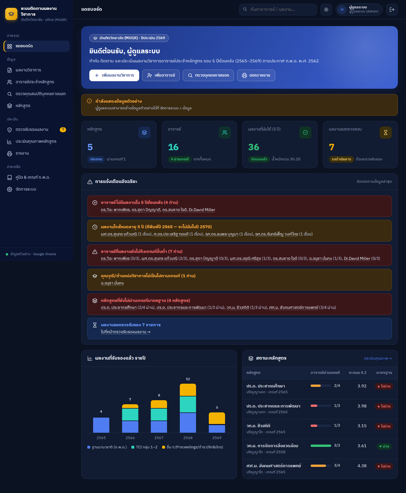

**ความสามารถหลัก**

- แดชบอร์ดพร้อม **การแจ้งเตือนอัจฉริยะ** (อาจารย์ไม่มีผลงาน, ผลงานใกล้หมดอายุ 5 ปี, ผลงานไม่ถึงเกณฑ์, หลักสูตรไม่ผ่านมาตรฐาน)
- เพิ่ม/แก้ไข/ลบผลงาน พร้อม **คำนวณน้ำหนักคะแนนทันที** และ **เตือนผลงานเกิน 5 ปี**
- **Verification Workflow** — รอตรวจ → รับรอง / ไม่รับรอง (พร้อมเหตุผล) เลือกรับรองหลายรายการได้
- ตรวจคุณสมบัติ **ผู้ทรงคุณวุฒิภายนอก** เทียบเกณฑ์ 2548 / 2558 / 2565 พร้อมลิงก์ค้นหา Scopus, ThaiJO, TCI, WoS, PubMed, ERIC, Google Scholar
- **ประเมินคุณภาพหลักสูตร** (การกำกับมาตรฐาน + ตัวบ่งชี้ 4.2) และ **ออกรายงาน PDF / CSV**
- 4 บทบาท: ผู้ดูแลระบบ · ประธานหลักสูตร · อาจารย์ · ผู้บริหาร — ตรวจสิทธิ์ฝั่งเซิร์ฟเวอร์ทุกคำสั่ง
- **โหมดมืด/สว่าง** · รองรับมือถือ · ค้นหาทั้งระบบ (กด <kbd>/</kbd>) · บันทึกการใช้งาน (Audit log)

---

## สารบัญ

1. [การติดตั้ง](#1-การติดตั้ง)
2. [สิทธิ์และบทบาทผู้ใช้งาน (User Roles)](#2-สิทธิ์และบทบาทผู้ใช้งาน-user-roles)
3. [ขั้นตอนการใช้งานทุกหน้าจอ (Step-by-Step)](#3-ขั้นตอนการใช้งานทุกหน้าจอ-step-by-step)
   - 3.1 แดชบอร์ดและการแจ้งเตือนอัจฉริยะ
   - 3.2 เพิ่ม แก้ไข ลบ ผลงานวิชาการ และการแจ้งเตือนผลงานเกิน 5 ปี
   - 3.3 การตรวจรับรองผลงาน (Verification Workflow)
   - 3.4 การจัดการข้อมูลอาจารย์และหลักสูตร
   - 3.5 ตรวจคุณสมบัติบุคคลภายนอก
   - 3.6 การประเมินคุณภาพหลักสูตรและการออกรายงาน PDF
   - 3.7 จัดการระบบ
4. [ตารางเกณฑ์คะแนนตามประกาศ ก.พ.อ. พ.ศ. 2562](#4-ตารางเกณฑ์คะแนนตามประกาศ-กพอ-พศ-2562)
5. [คำถามที่พบบ่อยและการแก้ปัญหาเบื้องต้น (FAQ)](#5-คำถามที่พบบ่อยและการแก้ปัญหาเบื้องต้น-faq)
6. [โครงสร้างโค้ดและข้อมูล](#6-โครงสร้างโค้ดและข้อมูล)

---

## 1. การติดตั้ง

### วิธี A — คัดลอกวาง 3 ไฟล์ (แนะนำ)

ไฟล์พร้อมวางอยู่ในโฟลเดอร์ **`gas/`** (สร้างจาก `src/` ด้วย `node dev/build-gas-bundle.mjs`)

| ไฟล์ใน `gas/` | สร้างใน Apps Script อย่างไร | ชื่อที่ต้องพิมพ์ |
|---|---|---|
| `appsscript.json` | ⚙ การตั้งค่าโปรเจกต์ → ☑ แสดงไฟล์ Manifest → เปิดไฟล์แล้ววางทับ | (มีอยู่แล้ว) |
| `Code.gs` | ใช้ไฟล์ `Code.gs` ที่มีอยู่แล้ว ลบ `myFunction` ทิ้งแล้ววาง | (มีอยู่แล้ว) |
| `Index.html` | `+` → **HTML** | `Index` |

1. สร้าง **Google Sheets** ใหม่ด้วยบัญชีมหาวิทยาลัย ตั้งชื่อเช่น `MUGR — ฐานข้อมูลผลงานวิชาการ`
2. เมนู **ส่วนขยาย → Apps Script** ตั้งชื่อโปรเจกต์เช่น `MUGR ระบบติดตามผลงานวิชาการ`
3. วาง 3 ไฟล์ตามตารางด้านบน แล้วกด **Ctrl+S**
4. เลือกฟังก์ชัน **`setup`** → **▶ เรียกใช้** → อนุญาตสิทธิ์ (ขึ้น “Google ไม่ได้ยืนยันแอปนี้” ให้กด ขั้นสูง → ไปที่… → อนุญาต)
5. (ทางเลือก) เรียกใช้ **`setupWithSampleData`** เพื่อเติมข้อมูลตัวอย่าง
6. **การทำให้ใช้งานได้ → การทำให้ใช้งานได้รายการใหม่ → เว็บแอป** · ดำเนินการในฐานะ: **ฉัน** · ผู้มีสิทธิ์เข้าถึง: **ทุกคนภายในองค์กร**
7. คัดลอก URL ที่ลงท้าย `/exec` ส่งให้ผู้ใช้

> ใช้ `gas/` **หรือ** `src/` อย่างใดอย่างหนึ่ง ห้ามวางทั้งสองชุดในโปรเจกต์เดียวกัน (ชื่อฟังก์ชันจะซ้ำกัน)

### วิธี B — ใช้ clasp (แยก 12 ไฟล์จาก `src/`)

```bash
npm i -g @google/clasp && clasp login
cp .clasp.json.example .clasp.json   # ใส่ scriptId ของโปรเจกต์
clasp push                            # อัปโหลดไฟล์ใน src/
```

> **หมายเหตุสิทธิ์:** ระบบระบุตัวผู้ใช้ด้วย `Session.getActiveUser()` ซึ่งคืนอีเมลได้เมื่อผู้ใช้อยู่ในโดเมน Google Workspace เดียวกับผู้ Deploy
> หากผู้ใช้อยู่นอกโดเมน อีเมลจะว่าง — เปิด “อนุญาตผู้เยี่ยมชมดูแบบผู้บริหาร” ได้ที่ จัดการระบบ > ตั้งค่าทั่วไป (อ่านอย่างเดียว)

### ทดลองดูบนเครื่อง (ไม่ต้องใช้ Google)

```bash
node dev/build-preview.mjs           # สร้าง dev/preview/index.html (รันโค้ด .gs จริงบนตัวจำลอง Sheets)
npx http-server dev/preview -p 8765  # เปิด http://127.0.0.1:8765/index.html?seed
```

พารามิเตอร์: `?seed` เติมข้อมูลตัวอย่าง · `&reset` ล้างข้อมูลจำลอง · `&role=lecturer&fac=FS03` ดูในมุมมองอาจารย์

---

## 2. สิทธิ์และบทบาทผู้ใช้งาน (User Roles)

| ความสามารถ | ผู้ดูแลระบบ (Admin) | ประธานหลักสูตร | อาจารย์ | ผู้บริหาร |
|---|:-:|:-:|:-:|:-:|
| ดูแดชบอร์ดและการแจ้งเตือน | ✅ | ✅ | ของตนเอง | ✅ |
| เพิ่ม/แก้ไข/ลบ ผลงานวิชาการ | ✅ | ในหลักสูตรตน | ของตนเอง¹ | — |
| ตรวจรับรองผลงาน | ✅ | ในหลักสูตรตน² | — | — |
| จัดการข้อมูลอาจารย์ | ✅ | ในหลักสูตรตน | — | — |
| จัดการหลักสูตร | ✅ | — | — | — |
| ตรวจคุณสมบัติบุคคลภายนอก | ✅ | ✅ | — | ดูอย่างเดียว |
| ประเมินคุณภาพหลักสูตร | ✅ | ✅ | — | ดูอย่างเดียว |
| ออกรายงาน PDF / CSV | ✅ | ✅ | ของตนเอง | ✅ |
| ผู้ใช้ / ตั้งค่า / น้ำหนักคะแนน / ข้อมูลตัวอย่าง | ✅ | — | — | — |

¹ อาจารย์แก้ไข/ลบได้เฉพาะผลงานที่ **ยังไม่ได้รับรอง** ² ประธานหลักสูตร **รับรองผลงานของตนเองไม่ได้**

- ผู้ใช้คนแรกที่เปิดระบบ (ตาราง Users ว่าง) จะเป็น **ผู้ดูแลระบบ** อัตโนมัติ
- อาจารย์และประธานหลักสูตรต้อง **ผูกบัญชีกับรายชื่ออาจารย์** (ช่อง “อาจารย์ที่เชื่อมโยง”)
- ผู้ดูแลระบบ **ทดสอบสิทธิ์** ได้ที่เมนูชื่อผู้ใช้มุมขวาบน → “ดูระบบในมุมมองบทบาท”

| มุมมองอาจารย์ | มุมมองมือถือ |
|---|---|
| 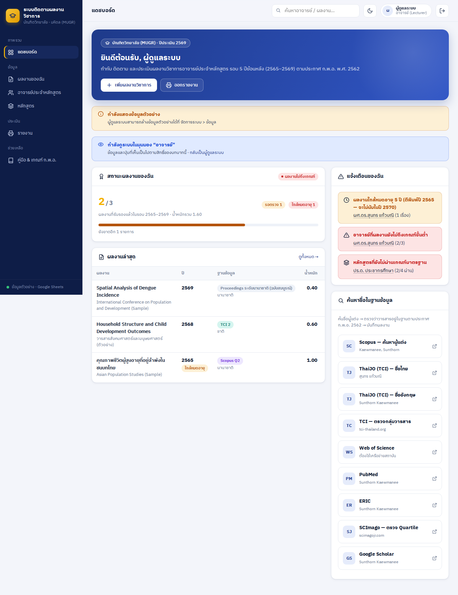 | 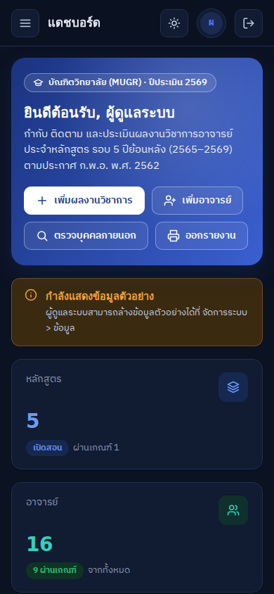 |

---

## 3. ขั้นตอนการใช้งานทุกหน้าจอ (Step-by-Step)

### 3.1 แดชบอร์ดและการแจ้งเตือนอัจฉริยะ

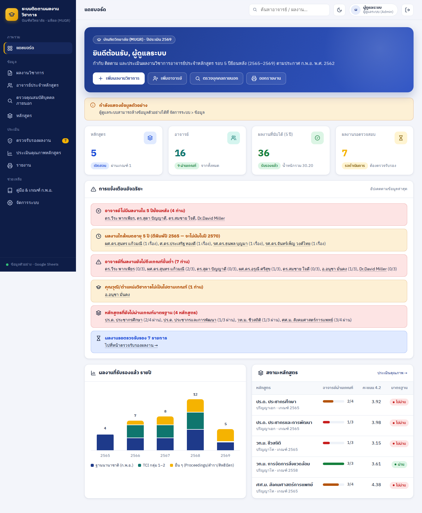

1. **การ์ดสรุป 4 ใบ** — หลักสูตรที่เปิดสอน · อาจารย์ (จำนวนที่ผ่านเกณฑ์) · ผลงานที่นับได้ใน 5 ปี (รับรองแล้วและน้ำหนัก > 0) · ผลงานรอตรวจ (คลิกไปหน้าตรวจรับรอง)
2. **การแจ้งเตือนอัจฉริยะ** (คลิกชื่อเพื่อเปิดรายละเอียด)

   | สี | การแจ้งเตือน | ความหมาย / สิ่งที่ควรทำ |
   |---|---|---|
   | 🔴 | อาจารย์ไม่มีผลงานใน 5 ปีย้อนหลัง | ไม่มีผลงานที่รับรองแล้วในรอบ — เร่งบันทึก/เผยแพร่ผลงาน |
   | 🟡 | ผลงานใกล้หมดอายุ 5 ปี | ผลงานปีแรกของรอบ (เช่น 2565 ในปีประเมิน 2569) จะ **ไม่นับในปีถัดไป** |
   | 🔴 | ผลงานยังไม่ถึงเกณฑ์ขั้นต่ำ (x/3) | ผลงานน้อยกว่า 3 รายการ หรือไม่มีผลงานวิจัย |
   | 🟡 | คุณวุฒิ/ตำแหน่งไม่เป็นไปตามเกณฑ์ | ป.โท ต้องมีตำแหน่ง ผศ. (หลักสูตร ป.โท) / รศ. (หลักสูตร ป.เอก) |
   | 🔴 | หลักสูตรไม่ผ่านเกณฑ์มาตรฐาน | อาจารย์ < 3 คน หรือมีอาจารย์ไม่ผ่านเกณฑ์ |
   | 🔵 | ผลงานรอตรวจรับรอง | มีงานค้างให้ผู้ตรวจ |

3. **กราฟผลงานรายปี** แยกฐานนานาชาติ (ก.พ.อ.) / TCI 1–2 / อื่น ๆ และ **ตารางสถานะหลักสูตร** พร้อมคะแนนตัวบ่งชี้ 4.2

### 3.2 เพิ่ม แก้ไข ลบ ผลงานวิชาการ และระบบแจ้งเตือนผลงานเกิน 5 ปี

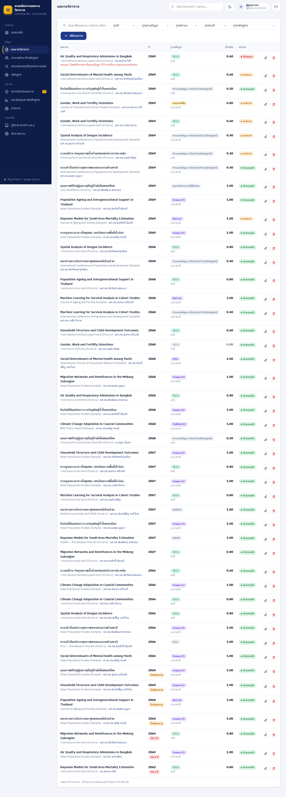

1. เมนู **ผลงานวิชาการ** → กรองด้วย ปี / ฐานข้อมูล / สถานะ / ช่วงปี (อยู่ในรอบ · ใกล้หมดอายุ · เกิน 5 ปี) / หลักสูตร
2. กด **➕ เพิ่มผลงาน** → เลือกเจ้าของผลงาน → ชื่อผลงาน → ประเภท → ปี **พ.ศ.** → ฐานข้อมูล → Quartile (เฉพาะ Scopus/WoS/PubMed)
3. ระบบแสดง **น้ำหนักคะแนน** และ **คำเตือนอายุผลงาน** ทันที:

   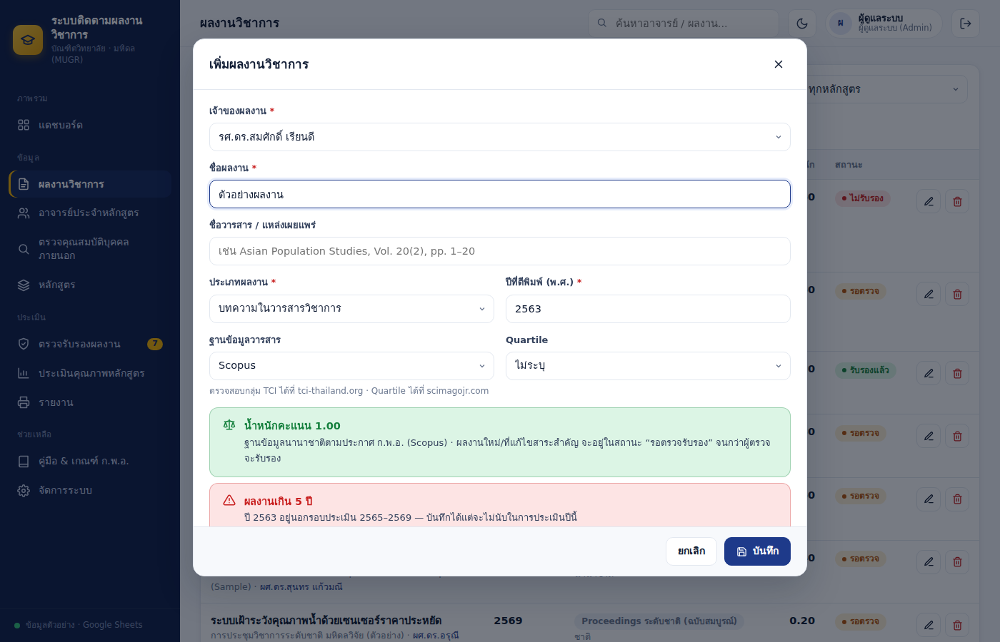

   - 🔴 **ผลงานเกิน 5 ปี** — ปีอยู่นอกรอบ บันทึกได้แต่ไม่นับ
   - 🟡 **ผลงานใกล้หมดอายุ** — ปีแรกของรอบ จะไม่นับปีถัดไป
   - 🔵 **ปีอนาคต** — ตรวจว่ากรอก พ.ศ. ถูกต้อง
4. **บันทึก** → สถานะ “รอตรวจรับรอง”
5. แก้ไข ✏️ / ลบ 🗑️ ที่ท้ายแถว (ผลงานที่รับรองแล้ว อาจารย์แก้/ลบเองไม่ได้)

### 3.3 การตรวจรับรองผลงาน (Verification Workflow)

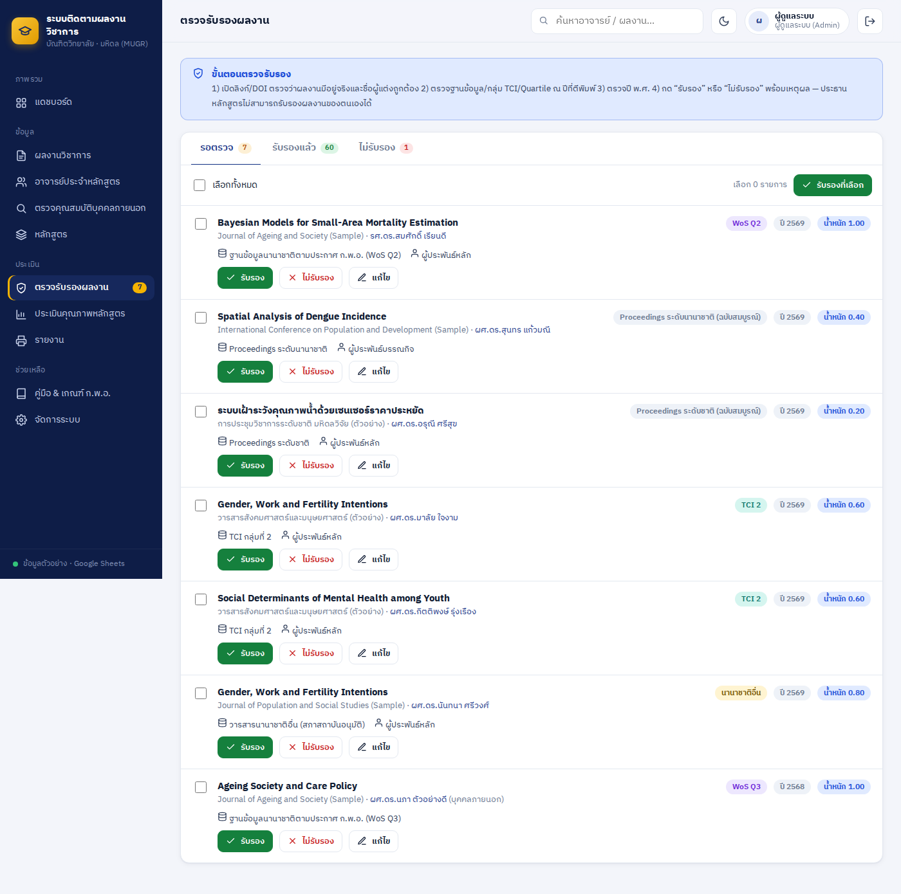

```
อาจารย์บันทึก ─▶ [รอตรวจ] ─▶ ผู้ตรวจตรวจหลักฐาน ─┬─▶ [รับรองแล้ว]  → นับคะแนน
                     ▲                           └─▶ [ไม่รับรอง] + เหตุผล
                     └──────── อาจารย์แก้ไขส่งใหม่ ◀──────┘
```

1. ผู้ตรวจ (ประธานหลักสูตร/Admin) เปิดเมนู **ตรวจรับรองผลงาน** (ตัวเลขสีเหลืองคือจำนวนรอตรวจ)
2. เปิด **DOI/ลิงก์** ตรวจ: มีอยู่จริง · ชื่อผู้แต่ง · ฐานข้อมูล/กลุ่ม TCI/Quartile **ณ ปีที่ตีพิมพ์** · ปี พ.ศ.
3. กด **✓ รับรอง** หรือ **✗ ไม่รับรอง** (ต้องระบุเหตุผล — อาจารย์จะเห็น) · เลือกหลายรายการแล้ว **รับรองที่เลือก**
4. แท็บ “รับรองแล้ว/ไม่รับรอง” ย้อนสถานะกลับเป็นรอตรวจได้
5. หากมีการแก้ไขสาระสำคัญ (ชื่อ ปี ประเภท ฐานข้อมูล Quartile) ผลงานจะกลับเป็น **รอตรวจ** อัตโนมัติ

### 3.4 การจัดการข้อมูลอาจารย์และหลักสูตร

| อาจารย์ประจำหลักสูตร | รายละเอียดอาจารย์ |
|---|---|
| 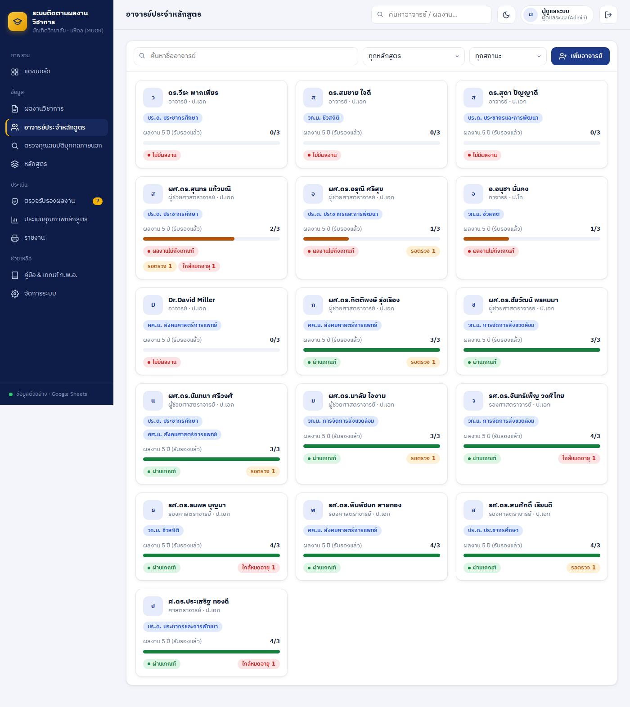 | 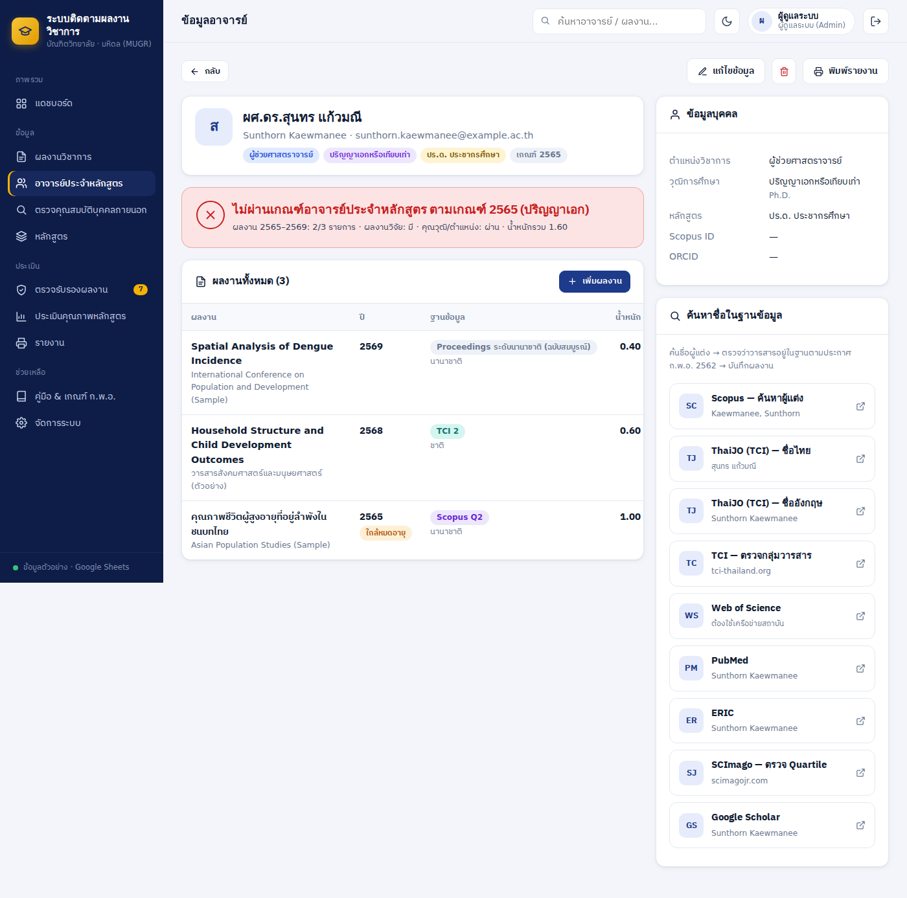 |

**หลักสูตร (Admin):** เมนู **หลักสูตร → เพิ่มหลักสูตร** กำหนดระดับ (โท/เอก), เกณฑ์มาตรฐาน (2558/2565), ประธานหลักสูตร

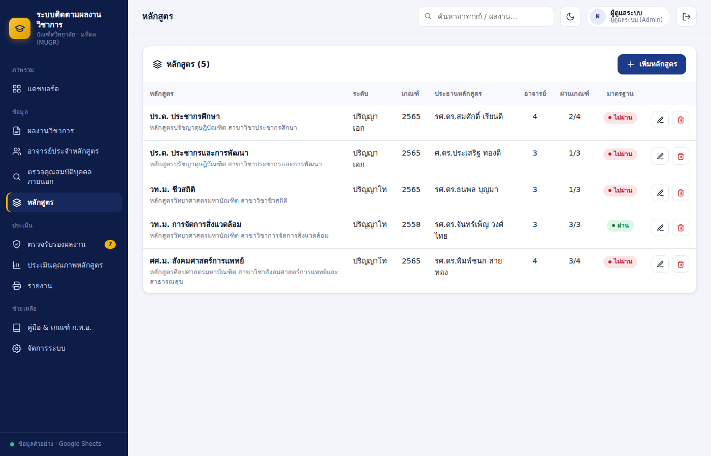

**อาจารย์ (Admin/ประธาน):** เมนู **อาจารย์ประจำหลักสูตร → เพิ่มอาจารย์** — ตำแหน่ง คุณวุฒิ หลักสูตรที่ประจำ (เลือกได้หลายหลักสูตร) ชื่อภาษาอังกฤษ (ใช้ค้นฐานข้อมูล) Scopus ID / ORCID
- การ์ดอาจารย์แสดงแถบความคืบหน้า **ผลงาน x/3** และป้าย “รอตรวจ / ใกล้หมดอายุ”
- หน้ารายละเอียดมีแบนเนอร์ผ่าน/ไม่ผ่าน ผลงานทั้งหมด และปุ่มลัดค้นหาในฐานข้อมูล

### 3.5 ตรวจคุณสมบัติบุคคลภายนอก

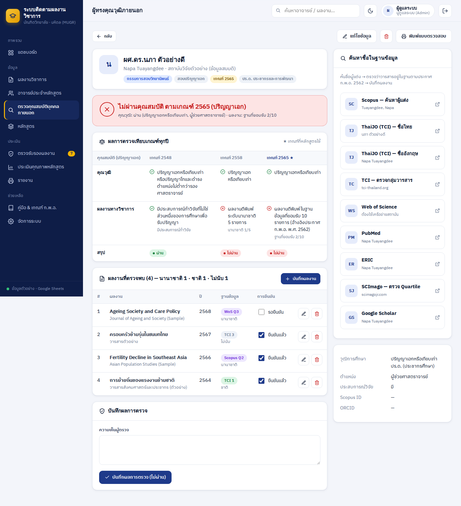

1. เมนู **ตรวจคุณสมบัติบุคคลภายนอก → เพิ่มบุคคลภายนอก** (คุณวุฒิ ตำแหน่ง บทบาท ระดับ เกณฑ์ที่หลักสูตรใช้)
2. ใช้ปุ่ม **ค้นหาชื่อในฐานข้อมูล** (ขวา) → **บันทึกผลงาน** ที่พบ
3. ติ๊ก **ยืนยัน** ผลงานที่ตรวจแล้ว — ตาราง “ผลการตรวจเทียบเกณฑ์ทุกปี” คำนวณใหม่ทันที (★ = เกณฑ์ที่หลักสูตรใช้)
4. เขียน **ความเห็นผู้ตรวจ** → **บันทึกผลการตรวจ** → **พิมพ์แบบตรวจสอบ**

### 3.6 การประเมินคุณภาพหลักสูตรและการออกรายงาน PDF

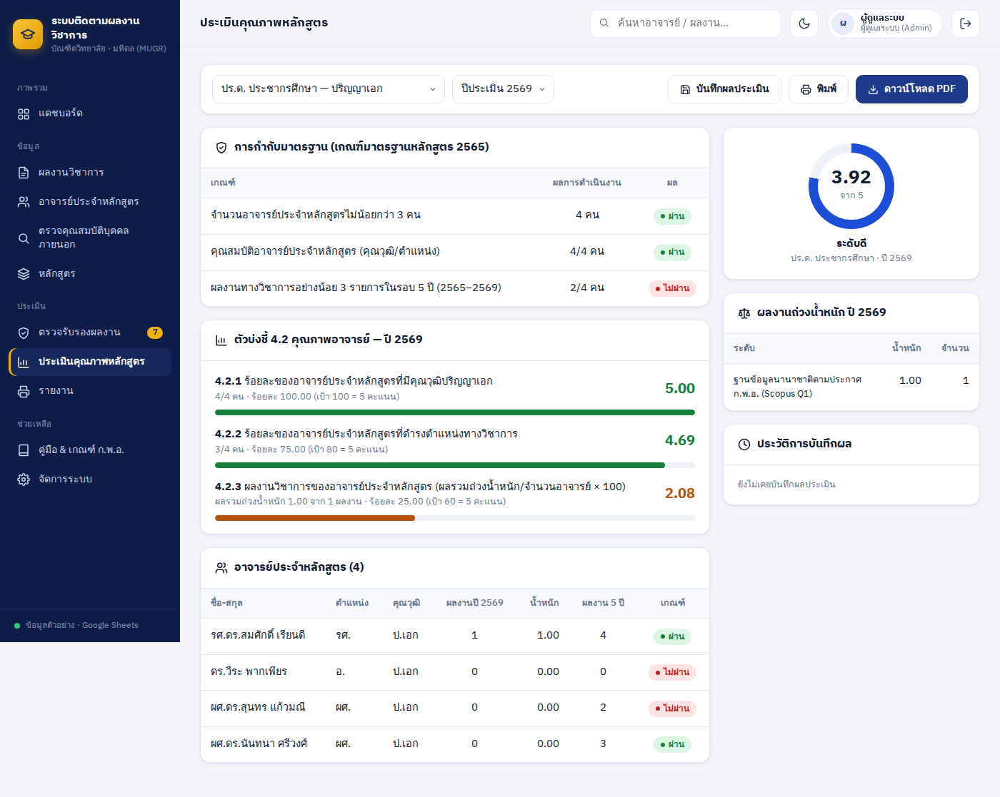

1. เมนู **ประเมินคุณภาพหลักสูตร** → เลือกหลักสูตรและปี
2. ระบบคำนวณ **การกำกับมาตรฐาน** (จำนวน/คุณสมบัติ/ผลงานอาจารย์) และ **ตัวบ่งชี้ 4.2.1–4.2.3** เป็นคะแนน 0–5
3. **บันทึกผลประเมิน** เพื่อเก็บประวัติ · **ดาวน์โหลด PDF** หรือ **พิมพ์**
4. เมนู **รายงาน** มี 4 รายงาน PDF + ส่งออก CSV:

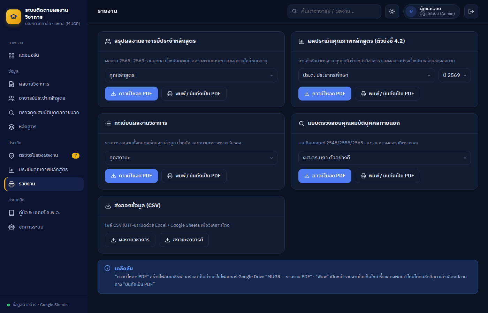

| รายงาน | เนื้อหา |
|---|---|
| สรุปผลงานอาจารย์ประจำหลักสูตร | รายบุคคล ผลงาน 5 ปี น้ำหนัก สถานะ ผลงานใกล้หมดอายุ |
| ผลประเมินคุณภาพหลักสูตร | มาตรฐาน + ตัวบ่งชี้ 4.2 + ตารางถ่วงน้ำหนัก + ช่องลงนาม |
| ทะเบียนผลงานวิชาการ | ผลงานทั้งหมดกรองตามสถานะ |
| แบบตรวจสอบคุณสมบัติบุคคลภายนอก | เทียบเกณฑ์ 3 ปี + รายการผลงาน + ช่องลงนาม |

> **ดาวน์โหลด PDF** สร้างไฟล์บนเซิร์ฟเวอร์และเก็บสำเนาในโฟลเดอร์ Drive `MUGR — รายงาน PDF` ·
> **พิมพ์ / บันทึกเป็น PDF** เปิดรายงานในแท็บใหม่ (ฟอนต์ Sarabun คมชัดที่สุด)

### 3.8 ตรวจผลงานอัตโนมัติ (ค้นจากชื่อไทย-อังกฤษ / แนบไฟล์ผลงาน)

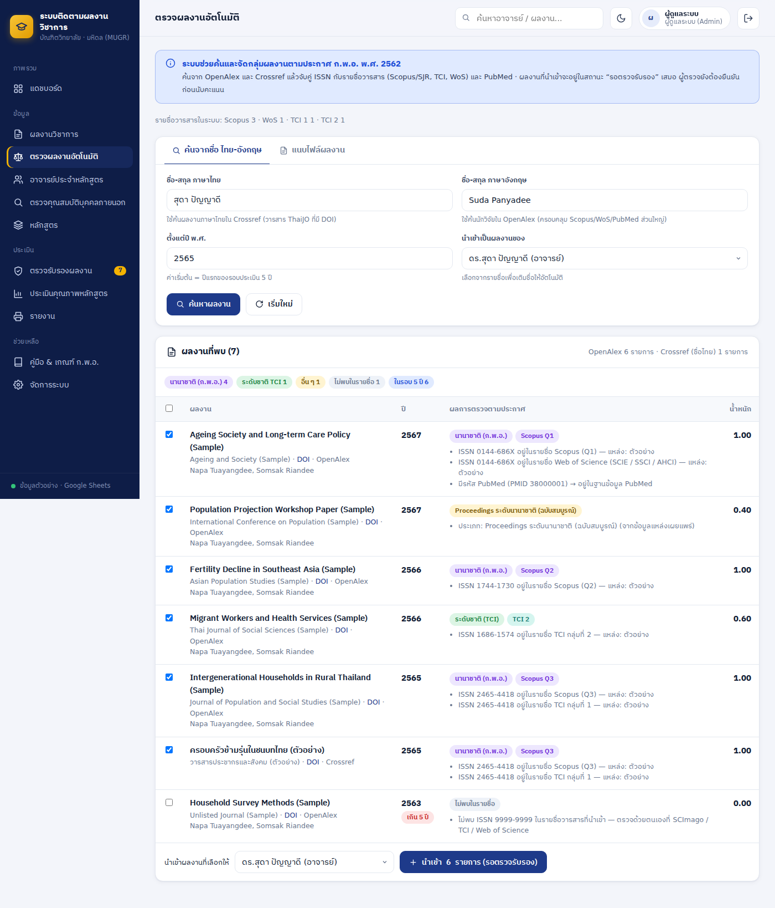

**เตรียมครั้งเดียว (Admin):** จัดการระบบ → **รายชื่อวารสาร** → นำเข้า CSV
- **Scopus + Quartile:** [scimagojr.com/journalrank.php](https://www.scimagojr.com/journalrank.php) → Download data → เลือกฐาน “Scopus”
- **TCI กลุ่ม 1 / 2:** [tci-thailand.org](https://tci-thailand.org/) → ดาวน์โหลดรายชื่อ → บันทึกเป็น CSV แยกกลุ่ม
- **Web of Science:** [mjl.clarivate.com](https://mjl.clarivate.com/) (ต้องลงทะเบียน)
- ผลงานที่มีรหัส PubMed ระบบตรวจได้เองโดยไม่ต้องนำเข้า

**ค้นจากชื่อ (ฐานใหญ่ก่อน):** เมนู **ตรวจผลงานอัตโนมัติ** (หรือปุ่ม “ค้นหาผลงานอัตโนมัติ” ในหน้าอาจารย์/บุคคลภายนอก) → กรอกชื่อไทย-อังกฤษ และ Scopus Author ID / ORCID ถ้ามี → ระบบค้นตามลำดับ

| ลำดับ | ฐานข้อมูล | วิธีค้น |
|:-:|---|---|
| 1 | **Scopus** | ค้นโดยตรงด้วย Scopus Search API (`AU-ID` หรือ `AUTHLASTNAME/AUTHFIRST`) — ต้องใส่ API key; ถ้าไม่มี key ตรวจผ่านรายชื่อ SJR |
| 2 | **Web of Science** | WoS Starter API (`AU=`) — ต้องใส่ API key; นับเฉพาะ SCIE/SSCI/AHCI (ESCI ไม่นับ) |
| 3 | **PubMed** | NCBI E-utilities (ฟรี) |
| 4 | **ERIC** | ERIC API (ฟรี) — นับเฉพาะบทความวารสาร (EJ) |
| 5 | **TCI / ThaiJO** | ค้นชื่อไทยใน Crossref + OpenAlex แล้วจับคู่ ISSN กับรายชื่อ TCI กลุ่ม 1/2 |
| 6 | **OpenAlex** | ฐานรวมขนาดใหญ่ เก็บผลงานที่เหลือ (JSTOR, MathSciNet, Project Muse ผ่านรายชื่อ ISSN) |

ผลงานจากทุกฐานถูกรวมและตัดซ้ำด้วย DOI/ชื่อเรื่อง แต่ละรายการบอกว่า “พบใน” ฐานใด แล้วแบ่งเป็น **กลุ่มที่ 1 นานาชาติ (แยกตาม Scopus / WoS / PubMed / ERIC / อื่น)**, **กลุ่มที่ 2 ระดับชาติ (TCI 1 / TCI 2)**, **กลุ่มที่ 3 ประเภทอื่น**, **กลุ่มที่ 4 ยังระบุไม่ได้** → ติ๊กเลือก → **นำเข้า** (สถานะรอตรวจรับรอง, ข้ามรายการซ้ำอัตโนมัติ)

**API key** (จัดการระบบ → รายชื่อวารสาร → การเชื่อมต่อฐานข้อมูล): Scopus — [dev.elsevier.com](https://dev.elsevier.com/) (สถาบันที่สมัครสมาชิก Scopus) · Web of Science — [developer.clarivate.com](https://developer.clarivate.com/) (Starter API) · key เก็บใน Script Properties

**แนบไฟล์ผลงาน:** แท็บ **แนบไฟล์ผลงาน** → เลือก PDF (หรือพิมพ์ DOI/ชื่อบทความ) → ระบบอ่านข้อความ 3 หน้าแรกด้วย pdf.js เพื่อหา DOI/ISSN → ค้นข้อมูลจริง → บอกว่าอยู่ในฐานใด พร้อมเดาเจ้าของผลงานจากรายชื่อผู้แต่ง → **บันทึกผลงาน** (เก็บไฟล์ใน Drive โฟลเดอร์ `MUGR — ไฟล์ผลงาน`)

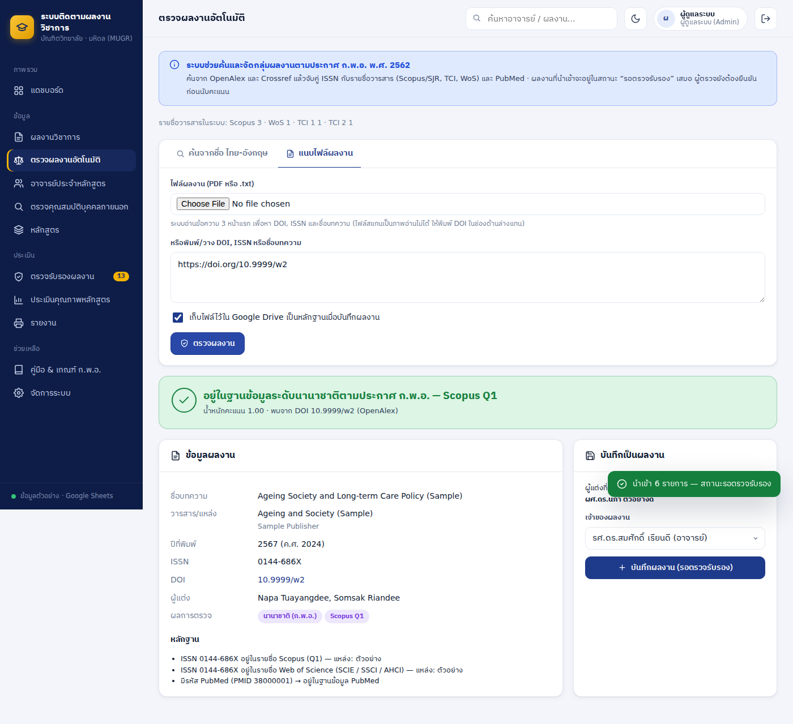

> ระบบไม่ตัดสินแทนผู้ตรวจ: ผลงานที่นำเข้าทุกชิ้นอยู่ในสถานะ “รอตรวจรับรอง” และมีหลักฐานในช่องหมายเหตุ ·
> ไฟล์ PDF ที่สแกนเป็นภาพอ่านข้อความไม่ได้ ให้พิมพ์ DOI แทน · ฟีเจอร์นี้ต้องอนุญาตสิทธิ์ “เชื่อมต่อบริการภายนอก” (รัน `setup` ใหม่หลังอัปเดตโค้ด)

### 3.7 จัดการระบบ (Admin)

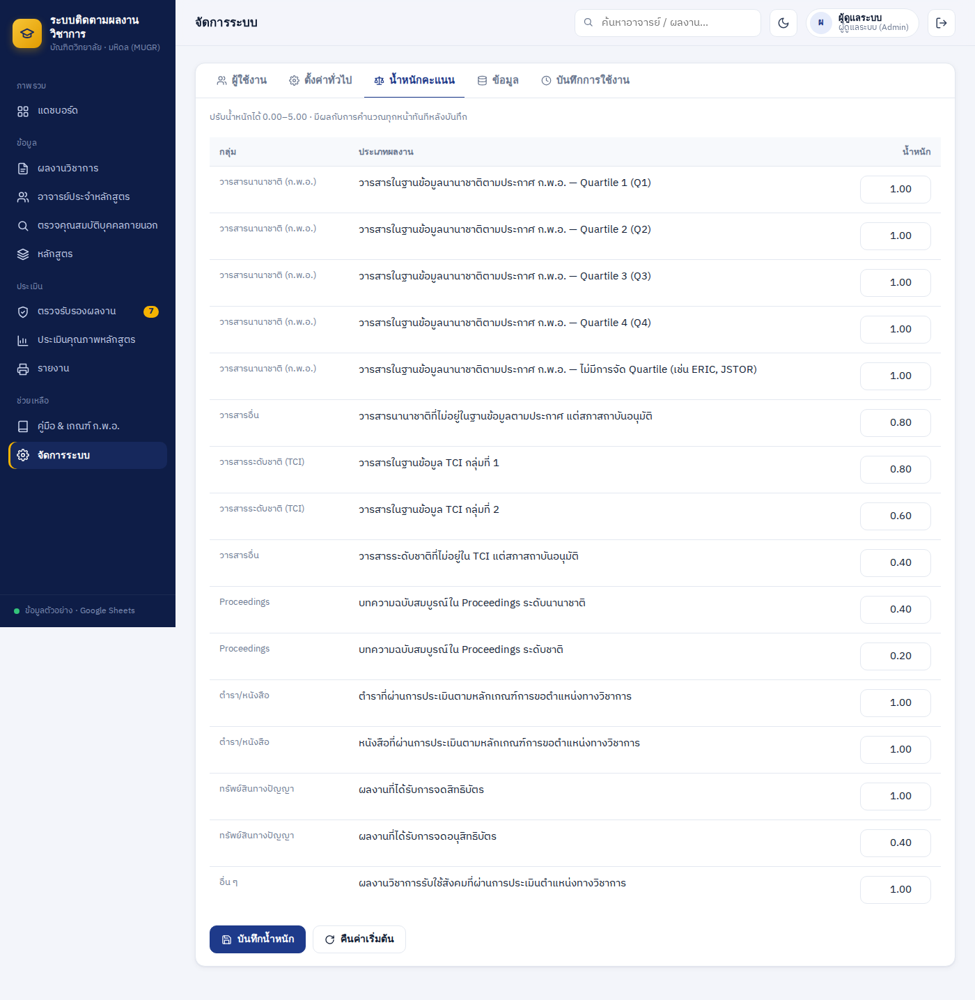

| แท็บ | ใช้ทำอะไร |
|---|---|
| ผู้ใช้งาน | เพิ่มอีเมล กำหนดบทบาท ผูกอาจารย์ หลักสูตรที่รับผิดชอบ เปิด/ปิดบัญชี |
| ตั้งค่าทั่วไป | ปีประเมิน (ว่าง = ปีปัจจุบัน), ชื่อหน่วยงาน, อนุญาตผู้เยี่ยมชม, เก็บ PDF ใน Drive |
| น้ำหนักคะแนน | ปรับน้ำหนักทุกประเภท (เช่น Q1–Q4 ต่างกัน) / คืนค่าเริ่มต้น |
| รายชื่อวารสาร | นำเข้า CSV (SJR/Scopus, TCI, WoS) สำหรับตรวจผลงานอัตโนมัติด้วย ISSN |
| ข้อมูล | เติม/ล้างข้อมูลตัวอย่าง, ล้างข้อมูลทั้งหมด, เปิดสเปรดชีต |
| บันทึกการใช้งาน | 200 รายการล่าสุด (ใคร ทำอะไร เมื่อไร) |

---

## 4. ตารางเกณฑ์คะแนนตามประกาศ ก.พ.อ. พ.ศ. 2562

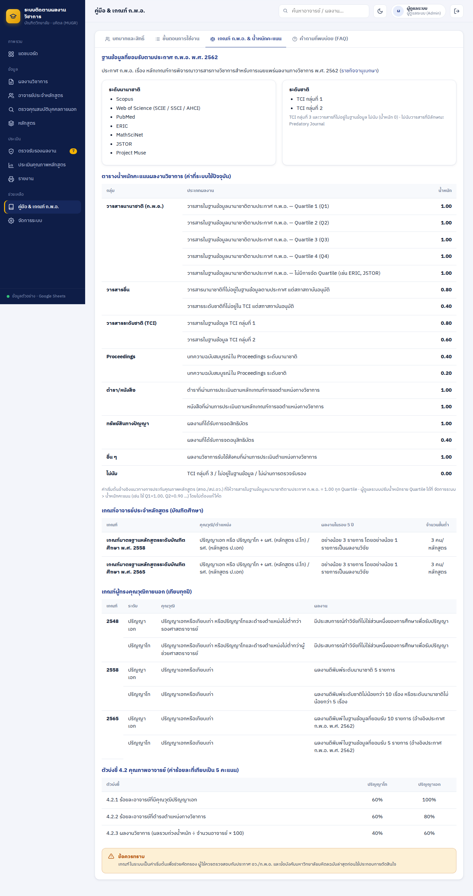

### 4.1 ฐานข้อมูลที่ยอมรับ

| ระดับ | ฐานข้อมูล |
|---|---|
| นานาชาติ | ERIC · MathSciNet · PubMed · Scopus · Web of Science (เฉพาะ SCIE, SSCI, AHCI) · JSTOR · Project Muse |
| ชาติ | TCI กลุ่มที่ 1 · TCI กลุ่มที่ 2 |
| ไม่นับ | TCI กลุ่มที่ 3 · วารสารที่ไม่อยู่ในฐานข้างต้น · วารสารลักษณะ Predatory |

### 4.2 น้ำหนักคะแนน (ค่าเริ่มต้น — แก้ไขได้ในระบบ)

| น้ำหนัก | ประเภทผลงาน |
|:-:|---|
| **1.00** | วารสารในฐานข้อมูลนานาชาติตามประกาศ ก.พ.อ. — **Scopus/WoS/PubMed Q1, Q2, Q3, Q4** และฐานที่ไม่จัด Quartile (ERIC, JSTOR ฯลฯ) |
| **1.00** | ตำรา / หนังสือ ที่ผ่านการประเมินตามหลักเกณฑ์การขอตำแหน่งทางวิชาการ |
| **1.00** | ผลงานที่ได้รับการจด **สิทธิบัตร** |
| **1.00** | ผลงานวิชาการรับใช้สังคมที่ผ่านการประเมินตำแหน่งทางวิชาการ |
| **0.80** | วารสาร **TCI กลุ่มที่ 1** |
| **0.80** | วารสารนานาชาติที่ไม่อยู่ในฐานตามประกาศ แต่สภาสถาบันอนุมัติ |
| **0.60** | วารสาร **TCI กลุ่มที่ 2** |
| **0.40** | บทความฉบับสมบูรณ์ใน **Proceedings ระดับนานาชาติ** |
| **0.40** | วารสารระดับชาติที่ไม่อยู่ใน TCI แต่สภาสถาบันอนุมัติ · **อนุสิทธิบัตร** |
| **0.20** | บทความฉบับสมบูรณ์ใน **Proceedings ระดับชาติ** |
| **0.00** | TCI กลุ่มที่ 3 / ไม่อยู่ในฐานข้อมูล / ยังไม่รับรอง |

> ค่าเริ่มต้นใช้แนวทางประกันคุณภาพหลักสูตร (สกอ./สป.อว.) ซึ่งให้ทุก Quartile = 1.00
> หากบัณฑิตวิทยาลัยต้องการถ่วงตามคุณภาพ เช่น Q1 = 1.00, Q2 = 0.90, Q3 = 0.80, Q4 = 0.70 ปรับได้ที่ **จัดการระบบ > น้ำหนักคะแนน**

### 4.3 เกณฑ์อาจารย์ประจำหลักสูตร (บัณฑิตศึกษา 2558 / 2565)

| รายการ | เกณฑ์ |
|---|---|
| จำนวนอาจารย์ประจำหลักสูตร | ไม่น้อยกว่า 3 คน |
| คุณวุฒิ / ตำแหน่ง | ปริญญาเอก หรือ ปริญญาโท + ผศ. (หลักสูตร ป.โท) / รศ. (หลักสูตร ป.เอก) |
| ผลงานทางวิชาการ | อย่างน้อย **3 รายการในรอบ 5 ปีย้อนหลัง** โดยอย่างน้อย 1 รายการเป็นผลงานวิจัย |

### 4.4 เกณฑ์ผู้ทรงคุณวุฒิภายนอก (ระบบเทียบให้ทุกปี)

| เกณฑ์ | ระดับ | คุณวุฒิ | ผลงาน |
|---|---|---|---|
| 2548 | เอก/โท | ป.เอก หรือ ป.โท + รศ. (เอก) / ผศ. (โท) | มีประสบการณ์ทำวิจัยที่ไม่ใช่ส่วนหนึ่งของการศึกษา |
| 2558 | เอก | ป.เอก | ผลงานตีพิมพ์ระดับนานาชาติ 5 รายการ |
| 2558 | โท | ป.เอก | ระดับชาติ ≥ 10 เรื่อง หรือ นานาชาติ ≥ 5 เรื่อง |
| 2565 | เอก | ป.เอก | ผลงานในฐานข้อมูลที่ยอมรับ (ก.พ.อ. 2562) 10 รายการ |
| 2565 | โท | ป.เอก | ผลงานในฐานข้อมูลที่ยอมรับ (ก.พ.อ. 2562) 5 รายการ |

### 4.5 ตัวบ่งชี้ 4.2 คุณภาพอาจารย์ (ร้อยละที่เทียบเท่า 5 คะแนน)

| ตัวบ่งชี้ | ป.โท | ป.เอก |
|---|:-:|:-:|
| 4.2.1 ร้อยละอาจารย์ที่มีคุณวุฒิปริญญาเอก | 60 | 100 |
| 4.2.2 ร้อยละอาจารย์ที่ดำรงตำแหน่งทางวิชาการ | 60 | 80 |
| 4.2.3 ผลงานวิชาการ = Σ(น้ำหนัก) ÷ จำนวนอาจารย์ × 100 | 40 | 60 |

คะแนน = min(5, ร้อยละ ÷ เป้า × 5) · คะแนนรวม = ค่าเฉลี่ย 3 ตัวบ่งชี้

> ⚠️ เกณฑ์ในระบบเป็นค่าเริ่มต้นเพื่อช่วยคัดกรอง ควรตรวจสอบกับประกาศ อว./ก.พ.อ. และข้อบังคับมหาวิทยาลัยมหิดลฉบับล่าสุด
> ค่าเกณฑ์แก้ไขได้ที่ `src/Config.gs` (`FACULTY_CRITERIA`, `EXPERT_CRITERIA`, `QA_TARGETS`)

---

## 5. คำถามที่พบบ่อยและการแก้ปัญหาเบื้องต้น (FAQ)

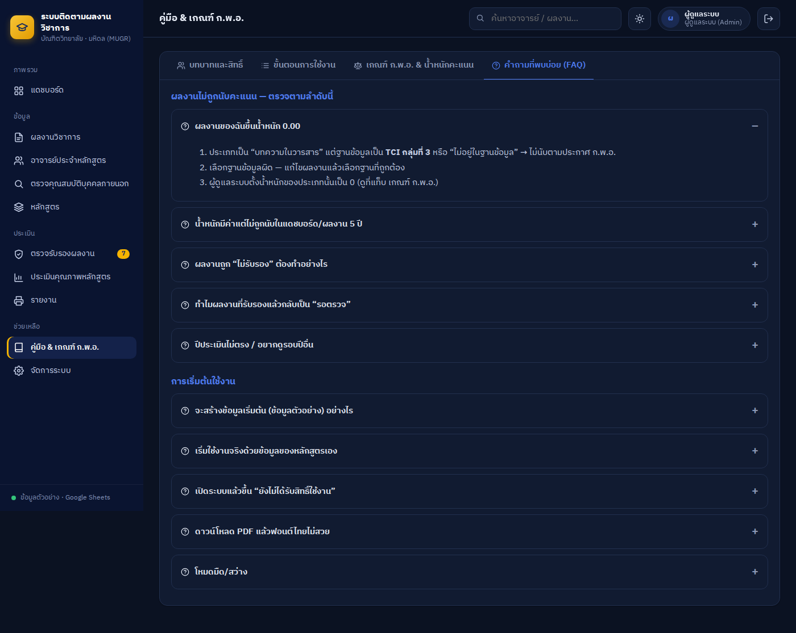

### ผลงานไม่คิดคะแนน (น้ำหนัก 0.00)
1. ประเภท “บทความในวารสาร” แต่ฐานข้อมูลเป็น **TCI กลุ่มที่ 3** หรือ “ไม่อยู่ในฐานข้อมูล” → ไม่นับตามประกาศ ก.พ.อ.
2. เลือกฐานข้อมูลผิด → แก้ไขผลงาน เลือกฐานที่ถูกต้อง
3. ผู้ดูแลระบบตั้งน้ำหนักประเภทนั้นเป็น 0

### มีน้ำหนักแต่ไม่ถูกนับใน “ผลงาน 5 ปี”
- สถานะยัง **รอตรวจ** หรือ **ไม่รับรอง** — นับเฉพาะ **รับรองแล้ว**
- ปีอยู่นอกรอบ (ป้าย **เกิน 5 ปี**)
- กรอกปีเป็น **ค.ศ.** (เช่น 2024) — ต้องเป็น **พ.ศ.** (2567) ระบบรับเฉพาะ 2500–2700
- อาจารย์ไม่ได้เลือกหลักสูตร หรือถูกตั้งเป็น “ไม่ใช้งาน”

### ผลงานถูก “ไม่รับรอง”
ดูเหตุผล (ตัวอักษรสีแดงใต้ชื่อผลงาน) → แก้ไข/เพิ่ม DOI หรือลิงก์หลักฐาน → บันทึก → กลับเป็น “รอตรวจ”

### ผลงานที่รับรองแล้วกลับเป็น “รอตรวจ”
มีการแก้ไขสาระสำคัญโดยผู้ที่ไม่มีสิทธิ์ตรวจ ระบบส่งกลับให้ตรวจใหม่เพื่อความถูกต้อง

### วิธีสร้างข้อมูลเริ่มต้น
- **ข้อมูลตัวอย่าง:** จัดการระบบ > ข้อมูล > **เติมข้อมูลตัวอย่าง** (หรือเมนู 🎓 MUGR ใน Sheets) — หลักสูตร 5 · อาจารย์ 16 · บุคคลภายนอก 3 · ผลงาน ~60 · บัญชีตัวอย่าง 3
- **ข้อมูลจริง:** เพิ่มหลักสูตร → เพิ่มอาจารย์ → เพิ่มผู้ใช้และผูกอาจารย์ → อาจารย์บันทึกผลงาน → ประธานตรวจรับรอง
- **นำเข้าจำนวนมาก:** วางข้อมูลลงชีต `Faculty` / `Publications` ตามหัวคอลัมน์ (คอลัมน์ `id` ต้องไม่ซ้ำและไม่ว่าง; `curriculumIds` คั่นด้วย `,`; `year` เป็น พ.ศ.; `status` = `pending|verified|rejected`)
- ใช้งานจริงแล้ว: **ล้างข้อมูลตัวอย่าง** (ลบเฉพาะแถว `isSample = true`)

### “ยังไม่ได้รับสิทธิ์ใช้งาน”
อีเมลยังไม่อยู่ในรายชื่อผู้ใช้ → Admin เพิ่มที่ จัดการระบบ > ผู้ใช้งาน หรือเปิด “อนุญาตผู้เยี่ยมชม”

### ดาวน์โหลด PDF แล้วฟอนต์ไทยไม่สวย / ปุ่มพิมพ์ไม่เปิดหน้าต่าง
ใช้ปุ่ม **พิมพ์ / บันทึกเป็น PDF** แล้วเลือก “บันทึกเป็น PDF” · อนุญาต Pop-up สำหรับ `script.google.com`

### แก้โค้ดแล้วหน้าเว็บไม่เปลี่ยน
Deploy → **จัดการการทำให้ใช้งานได้** → แก้ไข → เวอร์ชัน **ใหม่** (URL `/exec` ใช้เวอร์ชันที่ Deploy ไว้; URL `/dev` ใช้โค้ดล่าสุด)

### เพิ่มคอลัมน์ใหม่ในตาราง
เพิ่มชื่อคอลัมน์ใน `TABLES` (`Config.gs`) และเพิ่มค่า `APP.schemaVersion` — ระบบเติมหัวคอลัมน์ให้อัตโนมัติ

---

## 6. โครงสร้างโค้ดและข้อมูล

```
src/
├── appsscript.json   # manifest (V8, Asia/Bangkok, Web App: Execute as Me / Domain)
├── Code.gs           # doGet, include, setup(), เมนูใน Sheets
├── Config.gs         # บทบาท สิทธิ์ โครงสร้างตาราง ฐานข้อมูลวารสาร น้ำหนัก เกณฑ์
├── Database.gs       # CRUD บน Google Sheets, Settings, Audit log
├── Logic.gs          # คำนวณน้ำหนัก, ตรวจเกณฑ์อาจารย์/บุคคลภายนอก, แจ้งเตือน, ตัวบ่งชี้ 4.2
├── Auth.gs           # ระบุผู้ใช้ บทบาท และสิทธิ์รายการ
├── Api.gs            # api(action, payload) — จุดเรียกเดียวจากหน้าเว็บ + LockService
├── Reports.gs        # รายงาน HTML → PDF (+ บันทึกลง Drive)
├── SampleData.gs     # ข้อมูลตัวอย่าง / ล้างข้อมูล
├── Discovery.gs      # ค้นผลงานจาก OpenAlex/Crossref, อ่าน DOI จากไฟล์, จัดกลุ่มด้วยรายชื่อ ISSN
├── Index.html        # โครงหน้า (sidebar, topbar)
├── Styles.html       # CSS + โหมดมืด/สว่าง
└── App.html          # SPA: ทุกหน้าจอ ฟอร์ม การค้นหา
dev/                  # ตัวจำลอง GAS สำหรับเปิดดูบนเครื่อง + สคริปต์ถ่ายภาพคู่มือ
docs/images/          # ภาพประกอบคู่มือ
```

**ชีตในฐานข้อมูล:** `Users` · `Curricula` · `Faculty` · `Experts` · `Publications` · `Assessments` · `JournalIndex` · `Settings` · `Audit`

| ตาราง | คอลัมน์สำคัญ |
|---|---|
| Publications | `personType` (faculty/expert), `personId`, `title`, `source`, `year` (พ.ศ.), `type`, `database`, `quartile`, `status`, `verifyNote`, `verifiedBy` |
| Faculty | `prefix`, `nameTh`, `nameEn`, `position` (อ./ผศ./รศ./ศ.), `degree` (doctoral/master), `curriculumIds` |
| Curricula | `code`, `nameTh`, `level` (master/doctoral), `criteriaYear` (2558/2565), `chairFacultyId`, `status` |
| Users | `email`, `role` (admin/chair/lecturer/executive), `facultyId`, `curriculumIds`, `active` |

ค่า `type`: `journal` · `proceedings_intl` · `proceedings_nat` · `textbook` · `book` · `patent` · `petty_patent` · `social`
ค่า `database`: `scopus` · `wos` · `pubmed` · `eric` · `mathscinet` · `jstor` · `projectmuse` · `tci1` · `tci2` · `tci3` · `other_intl` · `other_nat` · `none`

---

---

## 7. เว็บแอปแยก: ระบบตรวจผลงานวิชาการอัตโนมัติ (สาธารณะ)

ส่งลิงก์ให้ใครก็ใช้ได้ ไม่ต้องล็อกอิน — ทุกการค้นทำงานในนามผู้ Deploy (ใช้ API key และรายชื่อวารสารของผู้รวบรวม) และบันทึกลง Google Sheets ของผู้รวบรวม

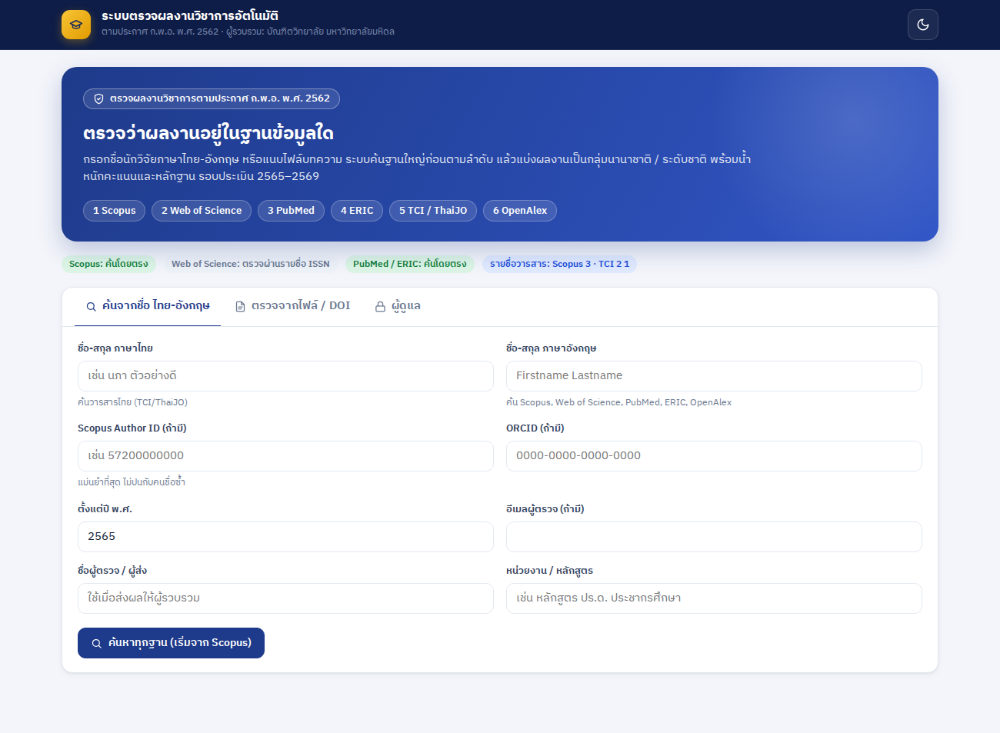

| ไฟล์ใน `checker/` | วางใน Apps Script |
|---|---|
| `Code.gs` | ไฟล์ `Code.gs` |
| `Index.html` | `+` → HTML → `Index` |
| `appsscript.json` | ไฟล์ manifest |

1. สร้าง Google Sheets ใหม่ (แยกจากระบบหลัก) → ส่วนขยาย → Apps Script → วาง 3 ไฟล์
2. รัน **`setup`** → อนุญาตสิทธิ์ → ดู **รหัสผู้ดูแล** ใน “บันทึกการดำเนินการ”
3. Deploy เว็บแอป: ดำเนินการในฐานะ **ฉัน** · ผู้มีสิทธิ์เข้าถึง **ทุกคน**
4. เปิดเว็บ → แท็บ **ผู้ดูแล** → ใส่รหัส → ใส่ Scopus API key → ทดสอบการเชื่อมต่อ → นำเข้ารายชื่อวารสาร SJR / TCI
5. ส่งลิงก์ `/exec` ให้ผู้ใช้ — ผลการค้นทุกครั้งอยู่ในชีต **CheckLog** และผลที่ผู้ใช้กด “ส่งผลให้ผู้รวบรวม” อยู่ในชีต **CheckResults**

ลำดับการค้น: 1) Scopus 2) Web of Science 3) PubMed 4) ERIC 5) TCI/ThaiJO 6) OpenAlex · จำกัด 20 ครั้ง/นาที (ปรับได้ด้วยค่า `CHECKER_PER_MINUTE` ในชีต Settings) · ลืมรหัสผู้ดูแล: รัน `resetAdminPasscode`

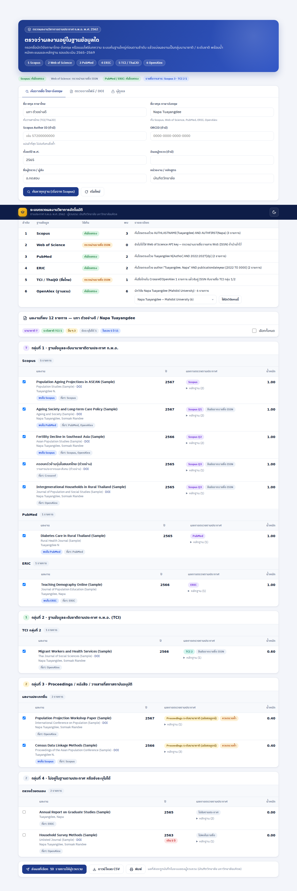

*ข้อมูลตัวอย่างในระบบและภาพประกอบเป็นข้อมูลสมมติทั้งหมด*